<p align="center">
  
</p>

<h1 align="center">Hydrogen Music · 酷狗概念版</h1>

<p align="center">
  一款基于 Electron 与 Vue 构建的跨平台音乐播放器<br />
  在 Hydrogen Music 原有体验上，接入酷狗概念版相关能力
</p>

<p align="center">
  <a href="#-功能特性">功能特性</a> ·
  <a href="#-界面展示">界面展示</a> ·
  <a href="#%EF%B8%8F-下载安装">下载安装</a> ·
  <a href="#-本地开发">本地开发</a>
</p>

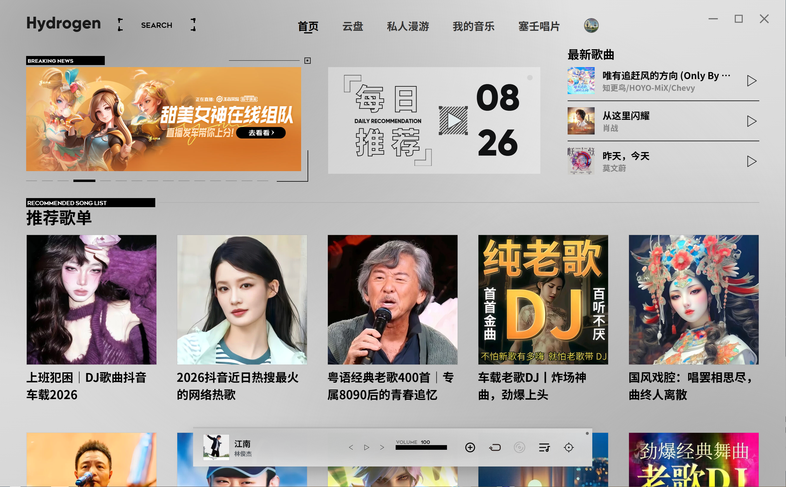

## 项目说明

本项目基于 [Hydrogen-Music](https://github.com/ldx123000/Hydrogen-Music) 修改而来。感谢原作者的创意与付出。

本项目将主要后端能力切换至 **酷狗概念版**，并在原有设计基础上继续完善播放、漫游、桌面歌词、音乐视频等功能。

这不是原版功能的完整迁移：部分能力已经完成适配，部分能力受现有接口限制只能提供有限支持。如原作者认为本项目存在不妥之处，请联系仓库维护者处理。

## 🌟 功能特性

- **账号与曲库**：支持酷狗账号登录，推荐使用酷狗 APP 扫码登录；支持歌曲、歌单、专辑、歌手与 MV 等内容
- **播放与歌词**：支持歌曲播放、歌词展示、歌曲下载及歌词/评论面板切换
- **云盘音乐**：支持读取、上传、删除、播放和下载云盘歌曲
- **私人漫游**：接入酷狗私人 FM，支持推荐模式切换、喜欢、不喜欢与上一首/下一首操作
- **塞壬唱片**：内置 Monster Siren 音乐专区，支持专辑浏览、搜索、播放与深浅色模式
- **音乐视频**：支持音乐视频背景及沉浸式播放界面
- **桌面歌词**：支持拖动、锁定、尺寸调整、当前/下一句显示和歌词来源切换，并提供完整与精简两种界面
- **电台与频道**：支持收听已收藏的电台节目
- **外观设置**：支持浅色/深色主题，以及跟随歌曲封面变化的界面背景
- **快捷键**：支持自定义应用内快捷键与全局快捷键
- **启动与更新**：提供五种可选启动动画，并支持应用更新检查与版本提示
- **跨平台安装**：提供 Windows、macOS（Apple Silicon/Intel）和 Linux x64 安装包

## ⚠️ 当前限制

- **云盘**：酷狗概念版后端暂未提供云盘详情接口
- **评论**：目前以浏览为主，暂不支持发送、回复、点赞等互动操作
- **收藏**：专辑收藏、收藏专辑列表等部分能力暂未开放
- **歌单**：部分旧版歌单编辑与操作能力尚未适配
- **音频后端**：HiFi 输出与 MPV 后端暂未移植
- **旧后端**：旧版网易云相关能力不再作为主要后端维护

## 🖼️ 界面展示

### 播放与评论

<table>
  <tr>
    <td width="50%" align="center">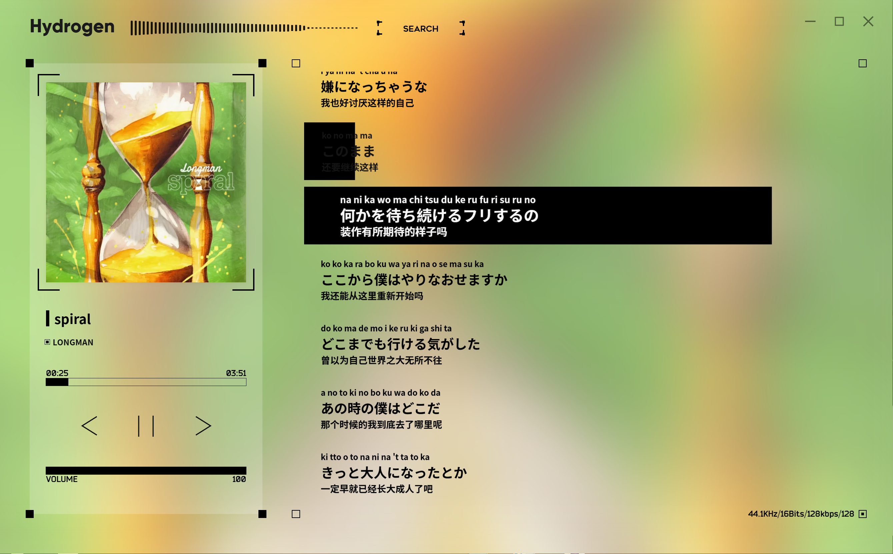<br /><sub>播放与歌词界面</sub></td>
    <td width="50%" align="center">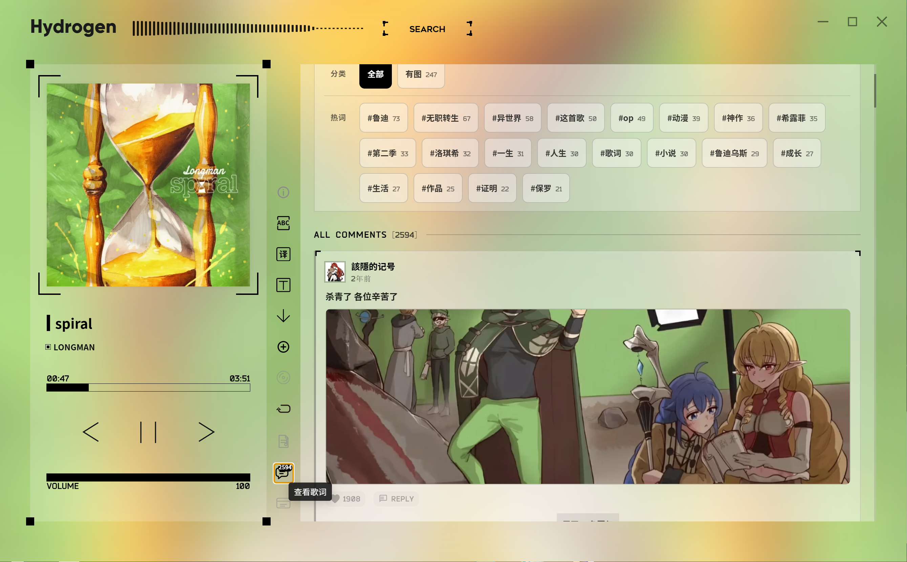<br /><sub>歌曲评论浏览</sub></td>
  </tr>
</table>

### 私人漫游

<table>
  <tr>
    <td width="50%" align="center">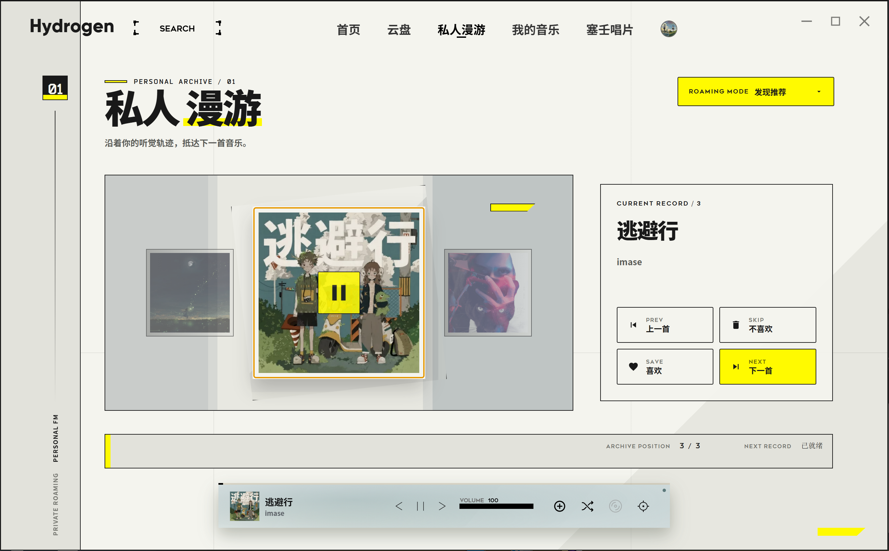<br /><sub>浅色模式</sub></td>
    <td width="50%" align="center">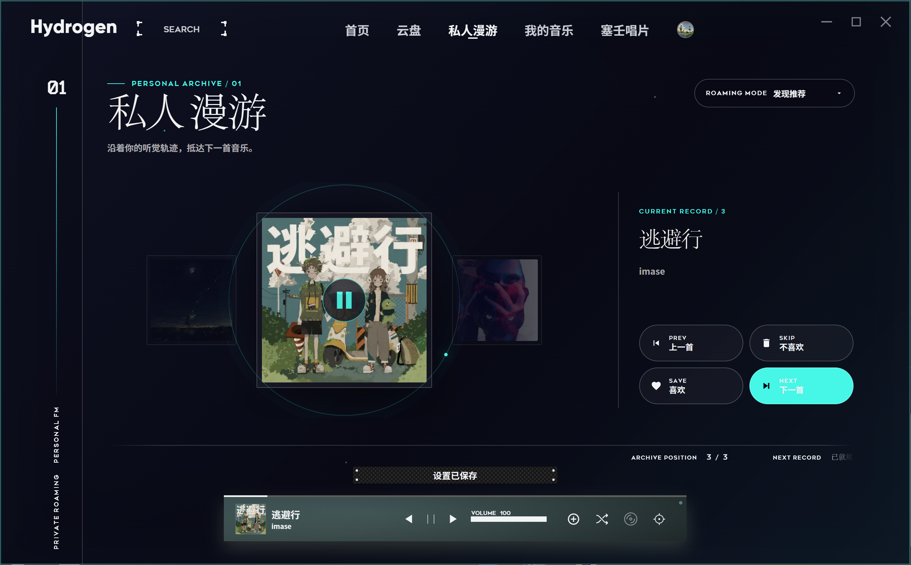<br /><sub>深色模式</sub></td>
  </tr>
</table>

### 塞壬唱片

<table>
  <tr>
    <td width="50%" align="center">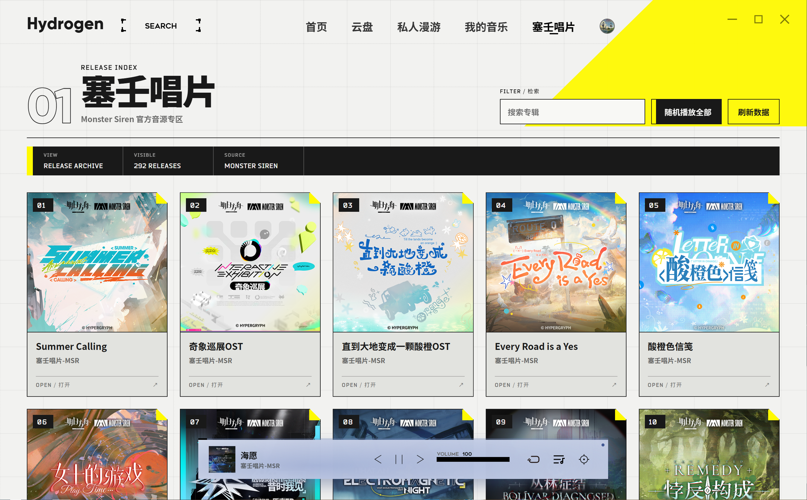<br /><sub>专辑列表 · 浅色模式</sub></td>
    <td width="50%" align="center">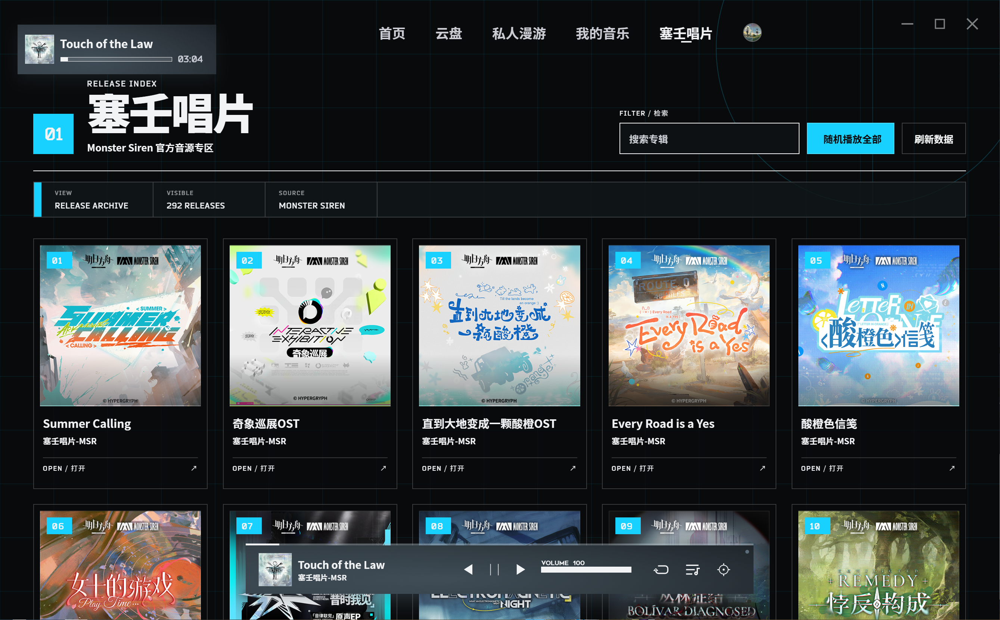<br /><sub>专辑列表 · 深色模式</sub></td>
  </tr>
  <tr>
    <td colspan="2" align="center">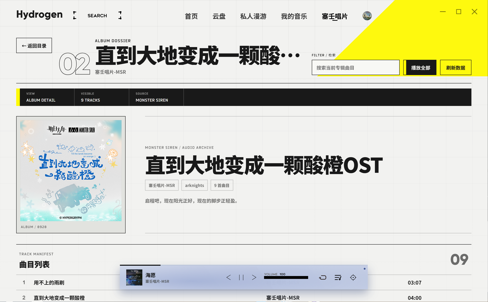<br /><sub>专辑详情与曲目列表</sub></td>
  </tr>
</table>

### 音乐视频

<table>
  <tr>
    <td width="50%" align="center"><br /><sub>沉浸模式</sub></td>
    <td width="50%" align="center"><br /><sub>歌词模式</sub></td>
  </tr>
</table>

### 桌面歌词

<table>
  <tr>
    <td width="60%" align="center">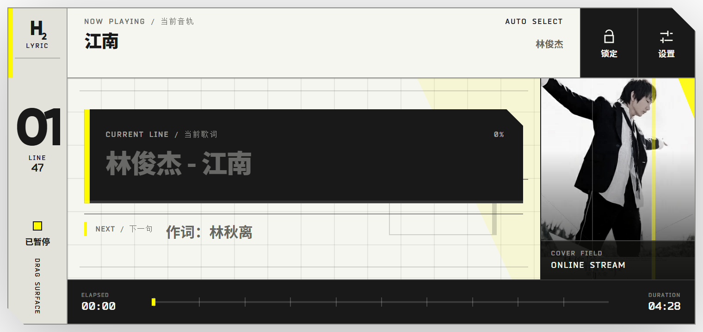<br /><sub>完整模式</sub></td>
    <td width="40%" align="center">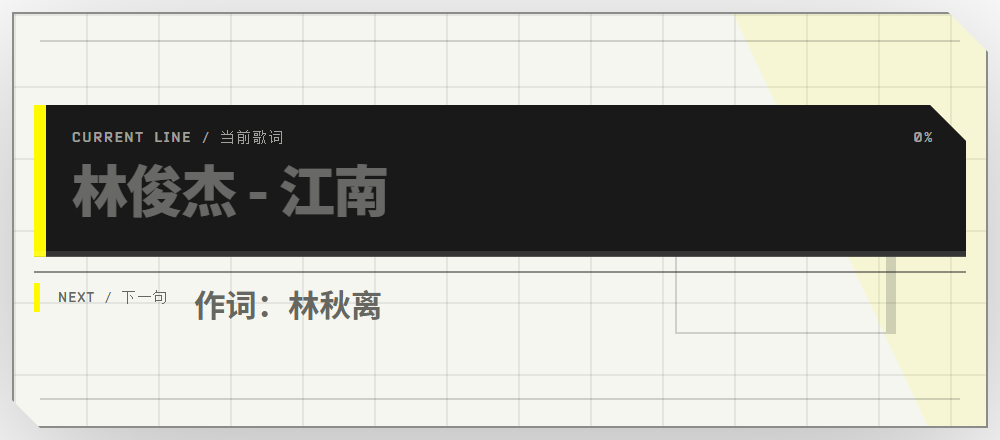<br /><sub>精简模式</sub></td>
  </tr>
</table>

<details>
  <summary><strong>查看更多：主题、快捷键、启动动画与更新提示</strong></summary>
  <br />
  <p align="center">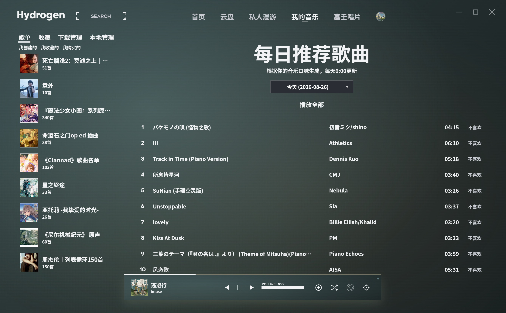<br /><sub>深色主题</sub></p>
  <p align="center">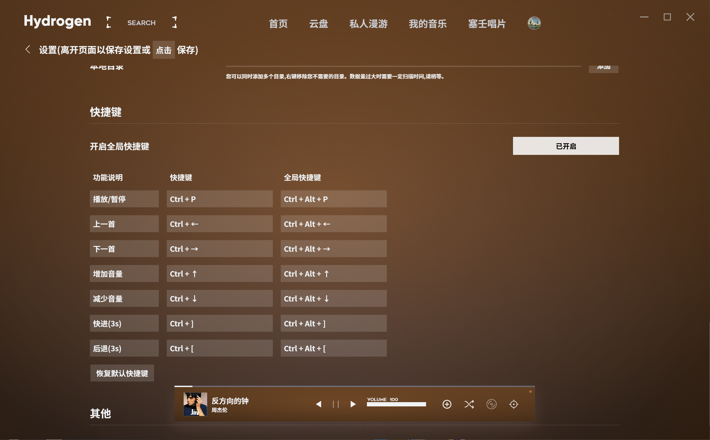<br /><sub>应用内与全局快捷键</sub></p>
  <p align="center">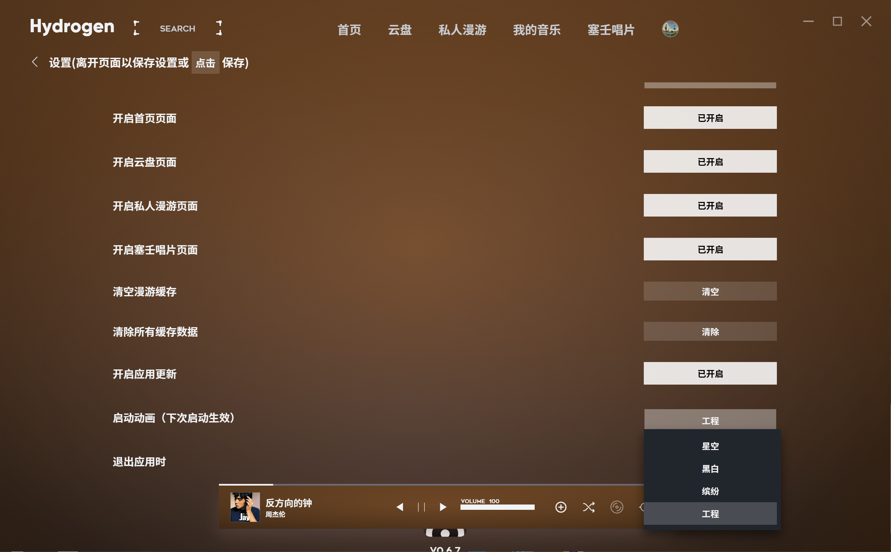<br /><sub>五种启动动画可选</sub></p>
  <p align="center">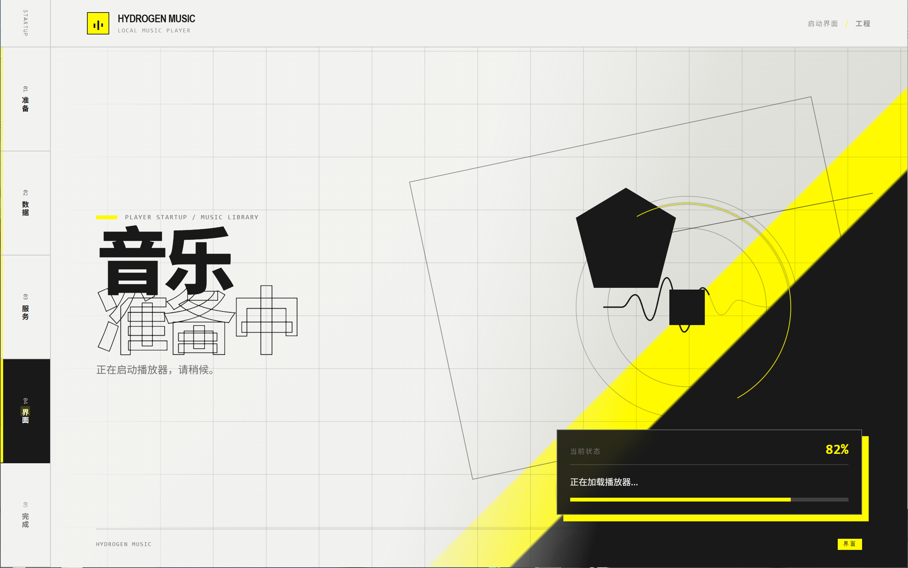<br /><sub>启动动画示例</sub></p>
  <p align="center">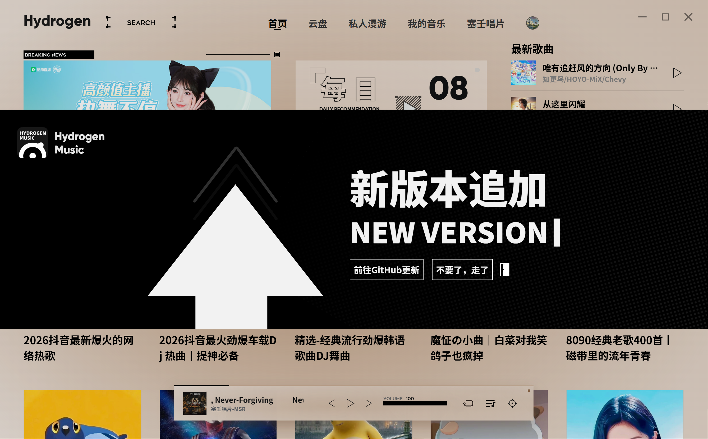<br /><sub>应用更新提示</sub></p>
</details>

## 📦️ 下载安装

前往 [Releases](https://github.com/Arihara-Satoru/Hydrogen-Music/releases) 下载对应平台的安装包：

- **Windows**：`.exe` 安装包、便携版或 `.zip`
- **macOS**：Apple Silicon（arm64）或 Intel（x64）的 `.dmg`
- **Linux x64**：`.AppImage`、`.deb` 或 `.rpm`

> macOS 安装包目前未使用 Apple Developer 证书签名，首次启动时可能需要在“系统设置 → 隐私与安全性”中确认打开。

## 🧑‍💻 本地开发

```shell
# 安装依赖
pnpm install

# 启动 Vue 开发服务
pnpm run dev

# 启动 Electron 客户端（请另开一个终端）
pnpm start
```

## 👷 打包客户端

```shell
# 在当前系统打包对应平台
pnpm run dist

# 也可以显式指定目标；macOS 包仍需在 macOS 上生成
pnpm run dist -- --win
pnpm run dist -- --mac
pnpm run dist -- --linux
```

## 📜 开源许可

本项目仅供个人学习与研究使用，禁止用于商业及非法用途。

项目基于 [MIT License](https://opensource.org/licenses/MIT) 开源。使用本项目时，请同时遵守相关平台的服务条款及所在地法律法规。

## 致谢

- [Kaidesuyo/Hydrogen-Music](https://github.com/Kaidesuyo/Hydrogen-Music)和[ldx123000/Hydrogen-Music](https://github.com/ldx123000/Hydrogen-Music) — 原始项目
- [OpenAI Codex](https://openai.com/codex/) — 感谢 Codex 在项目开发与完善过程中提供的协助
- [Brandon030722/ark-ui-skill](https://github.com/Brandon030722/ark-ui-skill) — 感谢该 Skill 仓库提供的界面设计灵感与工作流参考
- README 中的音乐视频示例取自哔哩哔哩视频 [BV1rTs3zyEPF](https://www.bilibili.com/video/BV1rTs3zyEPF)
- 感谢所有参与维护、测试和反馈的贡献者
